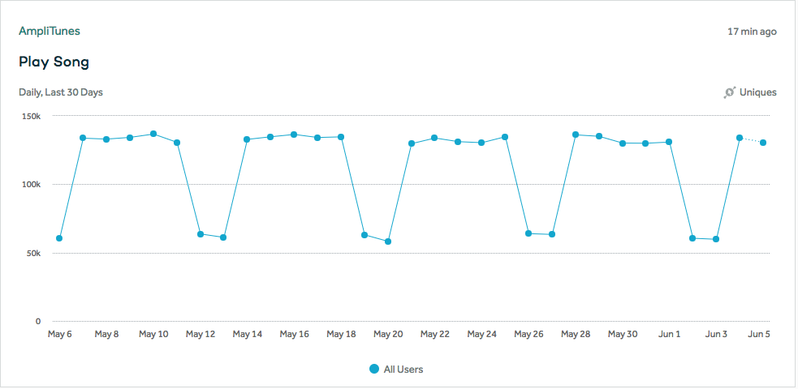
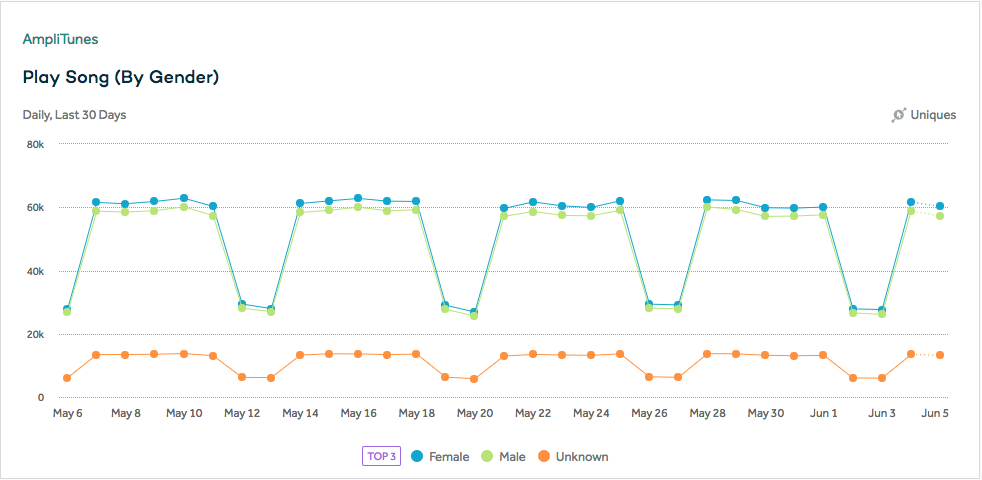

Amplitude Analytics is the leading product analytics tool. It helps you gather and democratize data about how users engage with your apps.

This doc gives an overview of the Amplitude Analytics concepts and resources you need to get started.

<div class="grid cards" markdown>

-   :material-book-open-variant:{ .lg .middle } __Learn the basics__

    ---

    Get familiar with the basics of Amplitude Analytics.

    [:octicons-arrow-right-24: Understand the basics](#understanding-amplitude-analytics)

-   :material-code-braces:{ .lg .middle } __Amplitude Analytics SDKs__

    ---

    Find the right Amplitude Analytics SDK for your app.

    [:octicons-arrow-right-24: See the SDKs](#amplitude-analytics-sdks)

-   :material-file-code-outline:{ .lg .middle } __Amplitude Analytics APIs__

    ---

    Explore the APIs for Amplitude Analytics.

    [:octicons-arrow-right-24: See the APIs](#amplitude-analytics-apis)

-   :material-help:{ .lg .middle } __Get more resources__

    ---

    Explore more resources for Amplitude Analytics.

    [:octicons-arrow-right-24: Resources](#more-resources)

</div>

## Amplitude Analytics SDKs

Our SDKs let you easily instrument Amplitude Analytics in your apps.

<div class="grid-container">
  <!--android--><div class="grid-item"><a href="/analytics/sdks/android-sdk" class="sdk-icons"><svg xmlns="http://www.w3.org/2000/svg" viewBox="0 0 576 512"><!--! Font Awesome Free 6.1.1 by @fontawesome - https://fontawesome.com License - https://fontawesome.com/license/free (Icons: CC BY 4.0, Fonts: SIL OFL 1.1, Code: MIT License) Copyright 2022 Fonticons, Inc. --><path d="M420.55,301.93a24,24,0,1,1,24-24,24,24,0,0,1-24,24m-265.1,0a24,24,0,1,1,24-24,24,24,0,0,1-24,24m273.7-144.48,47.94-83a10,10,0,1,0-17.27-10h0l-48.54,84.07a301.25,301.25,0,0,0-246.56,0L116.18,64.45a10,10,0,1,0-17.27,10h0l47.94,83C64.53,202.22,8.24,285.55,0,384H576c-8.24-98.45-64.54-181.78-146.85-226.55"/></svg>Android</a></div>
  <!--flutter--><div class="grid-item"><a href="/analytics/sdks/flutter-sdk" class="sdk-icons"><svg viewBox="0 0 24 24" role="img" xmlns="http://www.w3.org/2000/svg"><path d="M14.314 0L2.3 12 6 15.7 21.684.012h-7.357L14.314 0zm.014 11.072l-6.471 6.457 6.47 6.47H21.7l-6.46-6.468 6.46-6.46h-7.371z"/></svg>Flutter</a></div> 
  <!--ios--><div class="grid-item"><a href="/analytics/sdks/ios-sdk" class="sdk-icons"><svg xmlns="http://www.w3.org/2000/svg" viewBox="0 0 24 24"><path d="M2.09 16.8h1.66V9.76H2.09m.83-.92a.9.9 0 0 0 .92-.9c0-.5-.4-.9-.92-.9a.9.9 0 0 0-.92.9c0 .5.4.9.92.9m6.33-1.78C6.46 7.06 4.7 8.96 4.7 12c0 3.06 1.76 4.96 4.55 4.96s4.55-1.9 4.55-4.96c0-3.04-1.76-4.94-4.55-4.94m0 1.44c1.71 0 2.8 1.37 2.8 3.5 0 2.15-1.09 3.5-2.8 3.5-1.71 0-2.79-1.35-2.79-3.5 0-2.13 1.08-3.5 2.79-3.5m5.25 5.61c.07 1.76 1.5 2.85 3.72 2.85 2.32 0 3.78-1.14 3.78-2.96 0-1.43-.82-2.23-2.77-2.68l-1.1-.25c-1.18-.28-1.66-.65-1.66-1.29 0-.78.73-1.33 1.81-1.33 1.1 0 1.85.55 1.93 1.44h1.63c-.04-1.69-1.43-2.83-3.55-2.83-2.08 0-3.56 1.15-3.56 2.85 0 1.37.83 2.22 2.6 2.62l1.24.29c1.21.29 1.7.68 1.7 1.38 0 .8-.8 1.37-1.96 1.37s-2.05-.57-2.15-1.46H14.5Z"/></svg>iOS</a></div>
  <!--JavaScript--><div class="grid-item"><a href="/analytics/sdks/javascript-sdk" class="sdk-icons"><svg xmlns="http://www.w3.org/2000/svg" viewBox="0 0 448 512"><!--! Font Awesome Free 6.1.1 by @fontawesome - https://fontawesome.com License - https://fontawesome.com/license/free (Icons: CC BY 4.0, Fonts: SIL OFL 1.1, Code: MIT License) Copyright 2022 Fonticons, Inc. --><path d="M0 32v448h448V32H0zm243.8 349.4c0 43.6-25.6 63.5-62.9 63.5-33.7 0-53.2-17.4-63.2-38.5l34.3-20.7c6.6 11.7 12.6 21.6 27.1 21.6 13.8 0 22.6-5.4 22.6-26.5V237.7h42.1v143.7zm99.6 63.5c-39.1 0-64.4-18.6-76.7-43l34.3-19.8c9 14.7 20.8 25.6 41.5 25.6 17.4 0 28.6-8.7 28.6-20.8 0-14.4-11.4-19.5-30.7-28l-10.5-4.5c-30.4-12.9-50.5-29.2-50.5-63.5 0-31.6 24.1-55.6 61.6-55.6 26.8 0 46 9.3 59.8 33.7L368 290c-7.2-12.9-15-18-27.1-18-12.3 0-20.1 7.8-20.1 18 0 12.6 7.8 17.7 25.9 25.6l10.5 4.5c35.8 15.3 55.9 31 55.9 66.2 0 37.8-29.8 58.6-69.7 58.6z"/></svg>JavaScript</a></div>
  <!--java--><div class="grid-item"><a href="/analytics/sdks/java-sdk" class="sdk-icons"><svg xmlns="http://www.w3.org/2000/svg" viewBox="0 0 384 512"><!--! Font Awesome Free 6.1.1 by @fontawesome - https://fontawesome.com License - https://fontawesome.com/license/free (Icons: CC BY 4.0, Fonts: SIL OFL 1.1, Code: MIT License) Copyright 2022 Fonticons, Inc. --><path d="M277.74 312.9c9.8-6.7 23.4-12.5 23.4-12.5s-38.7 7-77.2 10.2c-47.1 3.9-97.7 4.7-123.1 1.3-60.1-8 33-30.1 33-30.1s-36.1-2.4-80.6 19c-52.5 25.4 130 37 224.5 12.1zm-85.4-32.1c-19-42.7-83.1-80.2 0-145.8C296 53.2 242.84 0 242.84 0c21.5 84.5-75.6 110.1-110.7 162.6-23.9 35.9 11.7 74.4 60.2 118.2zm114.6-176.2c.1 0-175.2 43.8-91.5 140.2 24.7 28.4-6.5 54-6.5 54s62.7-32.4 33.9-72.9c-26.9-37.8-47.5-56.6 64.1-121.3zm-6.1 270.5a12.19 12.19 0 0 1-2 2.6c128.3-33.7 81.1-118.9 19.8-97.3a17.33 17.33 0 0 0-8.2 6.3 70.45 70.45 0 0 1 11-3c31-6.5 75.5 41.5-20.6 91.4zM348 437.4s14.5 11.9-15.9 21.2c-57.9 17.5-240.8 22.8-291.6.7-18.3-7.9 16-19 26.8-21.3 11.2-2.4 17.7-2 17.7-2-20.3-14.3-131.3 28.1-56.4 40.2C232.84 509.4 401 461.3 348 437.4zM124.44 396c-78.7 22 47.9 67.4 148.1 24.5a185.89 185.89 0 0 1-28.2-13.8c-44.7 8.5-65.4 9.1-106 4.5-33.5-3.8-13.9-15.2-13.9-15.2zm179.8 97.2c-78.7 14.8-175.8 13.1-233.3 3.6 0-.1 11.8 9.7 72.4 13.6 92.2 5.9 233.8-3.3 237.1-46.9 0 0-6.4 16.5-76.2 29.7zM260.64 353c-59.2 11.4-93.5 11.1-136.8 6.6-33.5-3.5-11.6-19.7-11.6-19.7-86.8 28.8 48.2 61.4 169.5 25.9a60.37 60.37 0 0 1-21.1-12.8z"/></svg>Java</a></div>
  <!--node--><div class="grid-item"><a href="/analytics/sdks/node-sdk" class="sdk-icons"><svg xmlns="http://www.w3.org/2000/svg" viewBox="0 0 448 512"><!--! Font Awesome Free 6.1.1 by @fontawesome - https://fontawesome.com License - https://fontawesome.com/license/free (Icons: CC BY 4.0, Fonts: SIL OFL 1.1, Code: MIT License) Copyright 2022 Fonticons, Inc. --><path d="M224 508c-6.7 0-13.5-1.8-19.4-5.2l-61.7-36.5c-9.2-5.2-4.7-7-1.7-8 12.3-4.3 14.8-5.2 27.9-12.7 1.4-.8 3.2-.5 4.6.4l47.4 28.1c1.7 1 4.1 1 5.7 0l184.7-106.6c1.7-1 2.8-3 2.8-5V149.3c0-2.1-1.1-4-2.9-5.1L226.8 37.7c-1.7-1-4-1-5.7 0L36.6 144.3c-1.8 1-2.9 3-2.9 5.1v213.1c0 2 1.1 4 2.9 4.9l50.6 29.2c27.5 13.7 44.3-2.4 44.3-18.7V167.5c0-3 2.4-5.3 5.4-5.3h23.4c2.9 0 5.4 2.3 5.4 5.3V378c0 36.6-20 57.6-54.7 57.6-10.7 0-19.1 0-42.5-11.6l-48.4-27.9C8.1 389.2.7 376.3.7 362.4V149.3c0-13.8 7.4-26.8 19.4-33.7L204.6 9c11.7-6.6 27.2-6.6 38.8 0l184.7 106.7c12 6.9 19.4 19.8 19.4 33.7v213.1c0 13.8-7.4 26.7-19.4 33.7L243.4 502.8c-5.9 3.4-12.6 5.2-19.4 5.2zm149.1-210.1c0-39.9-27-50.5-83.7-58-57.4-7.6-63.2-11.5-63.2-24.9 0-11.1 4.9-25.9 47.4-25.9 37.9 0 51.9 8.2 57.7 33.8.5 2.4 2.7 4.2 5.2 4.2h24c1.5 0 2.9-.6 3.9-1.7s1.5-2.6 1.4-4.1c-3.7-44.1-33-64.6-92.2-64.6-52.7 0-84.1 22.2-84.1 59.5 0 40.4 31.3 51.6 81.8 56.6 60.5 5.9 65.2 14.8 65.2 26.7 0 20.6-16.6 29.4-55.5 29.4-48.9 0-59.6-12.3-63.2-36.6-.4-2.6-2.6-4.5-5.3-4.5h-23.9c-3 0-5.3 2.4-5.3 5.3 0 31.1 16.9 68.2 97.8 68.2 58.4-.1 92-23.2 92-63.4z"/></svg>Node.js</a></div>
  <!--unity--><div class="grid-item"><a href="/analytics/sdks/unity-sdk" class="sdk-icons"><svg xmlns="http://www.w3.org/2000/svg" viewBox="0 0 448 512"><!--! Font Awesome Free 6.1.1 by @fontawesome - https://fontawesome.com License - https://fontawesome.com/license/free (Icons: CC BY 4.0, Fonts: SIL OFL 1.1, Code: MIT License) Copyright 2022 Fonticons, Inc. --><path d="M243.583 91.6027L323.695 138.384C326.575 140.026 326.68 144.583 323.695 146.225L228.503 201.854C225.623 203.55 222.22 203.444 219.549 201.854L124.357 146.225C121.425 144.636 121.373 139.973 124.357 138.384L204.417 91.6027V0L0 119.417V358.252L78.3843 312.477V218.914C78.3319 215.576 82.2066 213.192 85.0865 214.993L180.279 270.622C183.159 272.318 184.782 275.338 184.782 278.464V389.669C184.834 393.007 180.959 395.391 178.079 393.589L97.9673 346.808L19.583 392.583L224 512L428.417 392.583L350.033 346.808L269.921 393.589C267.093 395.338 263.114 393.06 263.218 389.669V278.464C263.218 275.126 265.051 272.159 267.721 270.622L362.914 214.993C365.741 213.245 369.72 215.47 369.616 218.914V312.477L448 358.252V119.417L243.583 0V91.6027Z"/></svg>Unity</a></div>
</div>

## Amplitude Analytics APIs

Amplitude Analytics has several APIs that let you easily extend Amplitude. 
!!!tip

    See the Amplitude Analytics Postman Collection for example requests and responses. 

    [](https://god.gw.postman.com/run-collection/20044411-a8a06899-34c5-4d6d-908f-9f70ba5bbdf9?action=collection%2Ffork&collection-url=entityId%3D20044411-a8a06899-34c5-4d6d-908f-9f70ba5bbdf9%26entityType%3Dcollection%26workspaceId%3D2ffc735a-10a6-4f54-818e-16c87aeebcd7#?env%5BAmplitude%20API%20Environment%5D=W3sia2V5IjoiYXBpX2tleSIsInZhbHVlIjoiSU5TRVJUIEFQSSBLRVkiLCJ0eXBlIjoic2VjcmV0IiwiZW5hYmxlZCI6dHJ1ZX0seyJrZXkiOiJzZWNyZXRfa2V5IiwidmFsdWUiOiJJTlNFUlQgU0VDUkVUIEtFWSIsInR5cGUiOiJzZWNyZXQiLCJlbmFibGVkIjp0cnVlfSx7ImtleSI6IlNDSU1fdG9rZW4iLCJ2YWx1ZSI6IklOU0VSVCBTQ0lNIFRPS0VOIiwidHlwZSI6InNlY3JldCIsImVuYWJsZWQiOnRydWV9LHsia2V5Ijoib3JnX2FwaV9rZXkiLCJ2YWx1ZSI6IklOU0VSVCBPUkcgQVBJIEtFWSIsInR5cGUiOiJzZWNyZXQiLCJlbmFibGVkIjp0cnVlfSx7ImtleSI6Im9yZ19zZWNyZXRfa2V5IiwidmFsdWUiOiJJTlNFUlQgT1JHIFNFQ1JFVCBLRVkiLCJ0eXBlIjoic2VjcmV0IiwiZW5hYmxlZCI6dHJ1ZX1d)


|API|This API lets you:|
|---|-----------|
|[Attribution](apis/attribution-api.md)| Send attribution campaign events (identified by `idfa`, `idfv`, or `adid`) that contain attribution information. |
|[Batch Event Upload](apis/batch-event-upload-api.md)| Upload large amounts of event data.|
|[Behavioral Cohorts](apis/behavioral-cohorts-api.md)|List all your cohorts in Amplitude, export a cohort in Amplitude, or upload a cohort.|
|[CCPA DSAR](apis/ccpa-dsar-api.md)| The Data Subject Access Request (DSAR) API makes it easy to retrieve all data about a user. |
|[Chart Annotations](apis/chart-annotations-api.md)|Programmatically annotate important dates like feature releases and marketing campaigns on your organization's charts with a horizontal axis of calendar dates. |
|[Dashboard REST](apis/dashboard-rest-api.md)| Get data that's displayed on the dashboard graphs in JSON format via the Dashboard REST API.|
|[Export](apis/export-api.md)|Export your projects's event data. |
|[Group Identify](apis/group-identify-api.md)|Set or update properties of particular groups.|
|[HTTP V2](apis/http-v2-api.md)|Send data directly from your server to the HTTP V2 endpoint.|
|[Identify](apis/identify-api.md)|Set the User ID for a particular Device ID or update user properties of a particular user without sending an event.|
|[Releases](apis/releases-api.md)|Programmatically create releases in Amplitude using the Releases API. |
|[SCIM](apis/scim-api.md)|Provision and manage users and groups. This API uses the System for Cross-domain Identity Management (SCIM) 2.0 Standard.|
|[Taxonomy](apis/taxonomy-api.md)|Create, get, update, and delete categories, event types, event properties, and user properties.|
|[User Privacy](apis/user-privacy-api.md)|Programmatically submit requests to delete all data for a set of known Amplitude IDs or User IDs.|

## Understanding Amplitude Analytics

To understand how Amplitude works, let’s walk through a hypothetical example.

Tunes is a standard music player for mobile devices that has common actions like playing a song, skipping a song, shuffling play, and sharing a song.

Using Amplitude, you can track all the actions your users make in detail and better understand what’s working and what’s not.

### What Amplitude tracks

Amplitude gives you the power to decide what actions you want to track. You can choose to track anything and everything.

For example, in Tunes, you could track the music control buttons the users presses or the number of songs each user has listened to in their sessions.

#### Events represent actions users have taken

Every time an action happens that you wish to keep track of, you send an Event to Amplitude. Events can be as easy as choosing the text string that defines them.
For example, in Tunes, you could send an “Play Song” event every time a user presses the Play button.

=== "JavaScript"

    ```js
    amplitude.getInstance().logEvent(‘play song’);
    ```

=== "iOS"

    ```swift
    [[Amplitude instance] logEvent:@"play song"];
    ```

=== "Android"

    ```kotlin
    Amplitude.getInstance().logEvent("play song");
    ```

=== "Unity"

    ```C#
    Amplitude.Instance.logEvent("play song");
    ```

Here is a chart with the number of songs played on each day:



#### Event properties give context

Event Properties give you context about events, like where in your app they occur or what state the app is in when it occurred.
For example, in Tunes, when someone presses the “Play Song” event, you can use event properties to track the
 title of the song, the artist, the genre, and more. Any detail related to the event can be an event property.

=== "JavaScript"

    ```js
    amplitude.getInstance().logEvent('play song',
    { title: 'Here comes the Sun',
      artist: 'The Beatles', genre: 'Rock'});
    ```

=== "iOS"

    ```swift
    NSMutableDictionary *songProperties = [NSMutableDictionary dictionary];
    [songProperties setValue:@"title" forKey:@"Here comes the Sun"];
    [songProperties setValue:@"artist" forKey:@"The Beatles"];
    [songProperties setValue:@"genre" forKey:@"Rock"];
    [[Amplitude instance] logEvent:@"play song" withEventProperties:songProperties];
    ```

=== "Android"

    ```kotlin
    JSONObject songProperties = new JSONObject();
    try {
        songProperties.put("title", "Here comes the Sun");
        songProperties.put("artist", "The Beatles");
        songProperties.put("genre", "Rock");
    } catch (JSONException exception) {
    }
    Amplitude.getInstance().logEvent("play song", songProperties);
    ```

=== "Unity"

    ```c#
    Dictionary<string, object> songProperties = new Dictionary<string, object>() {
      {"title" , "Here comes the Sun" },
      {"artist" , "The Beatles"},
      {"genre" , "Rock"}
    };
    Amplitude.Instance.logEvent("play song", songProperties);
    ```

Here is a chart with the songs played per day in each genre:


#### User Sessions are a series of Events in a single visit

User Sessions let you track series of events performed in a single visit or interaction with your application.

Most often, Amplitude keeps track of session automatically for you. If you are using the HTTP API, you must handle sessions manually.

#### User Properties are details about your User

User Properties help understand your User at the time they performed actions within your application.
 What state they were in, their preferences, or their device details, are all examples of common user properties.

For example, in Tunes, you could keep track of whether a user was on a paid or free plan.
 This lets you to segment these users by this property, and compare paid vs free users (to consider just the behavior of paying users).

=== "JavaScript"

    ```js
    var identify = new amplitude.Identify().set('plan', 'premium');
    amplitude.getInstance().identify(identify);
    ```

=== "iOS"

    ```swift
    AMPIdentify *identify = [[[AMPIdentify identify] set:@"plan" value:@"premium"]];
    [[Amplitude instance] identify:identify];
    ```

=== "Android"

    ```kotlin
    Identify identify = new Identify().set("plan", "premium");
    Amplitude.getInstance().identify(identify);
    ```

=== "Unity"

    ```c#
    Amplitude.Instance.setUserProperty("plan", "premium");
    ```

Here is an example of a chart segmented on the user property "gender":



## More resources

- *Help Center*: [Amplitude Analytics](https://help.amplitude.com/hc/en-us/categories/360006505092-Amplitude-Analytics)
- *API Examples*: [Postman Collection](https://www.postman.com/amplitude-developer-docs/workspace/amplitude-developers/collection/20044411-a8a06899-34c5-4d6d-908f-9f70ba5bbdf9)